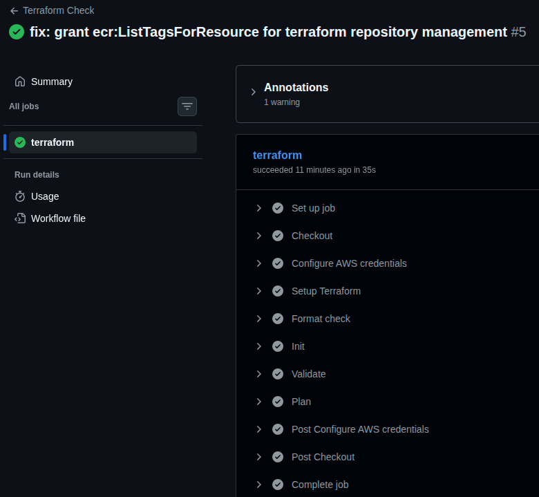
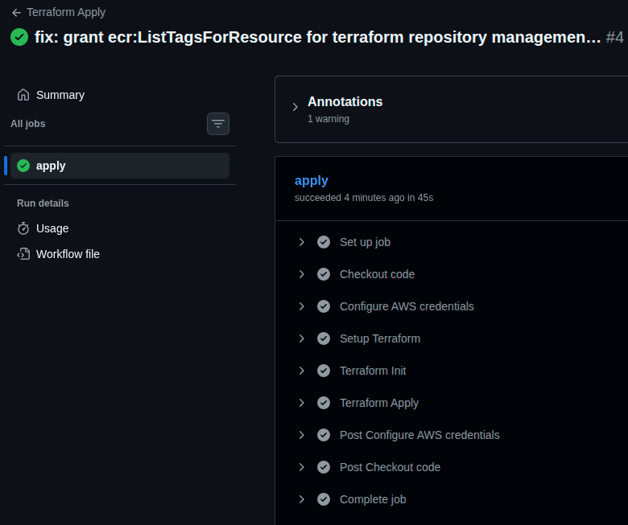
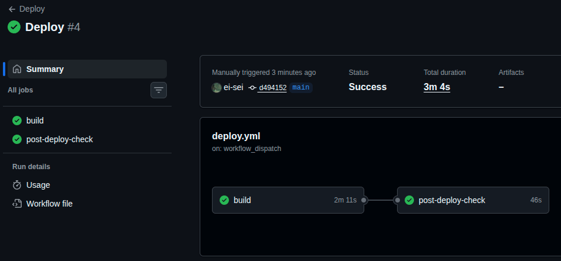
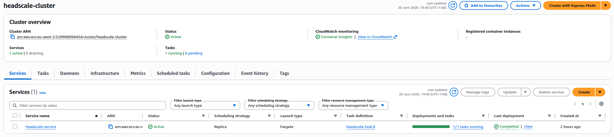
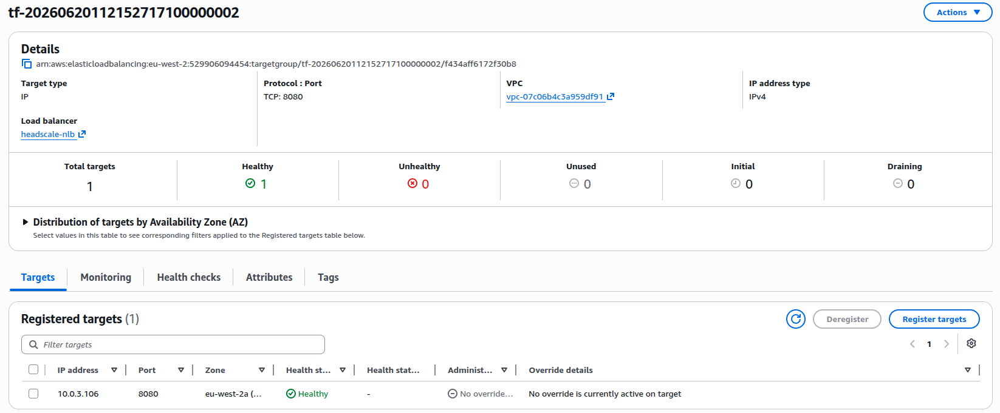
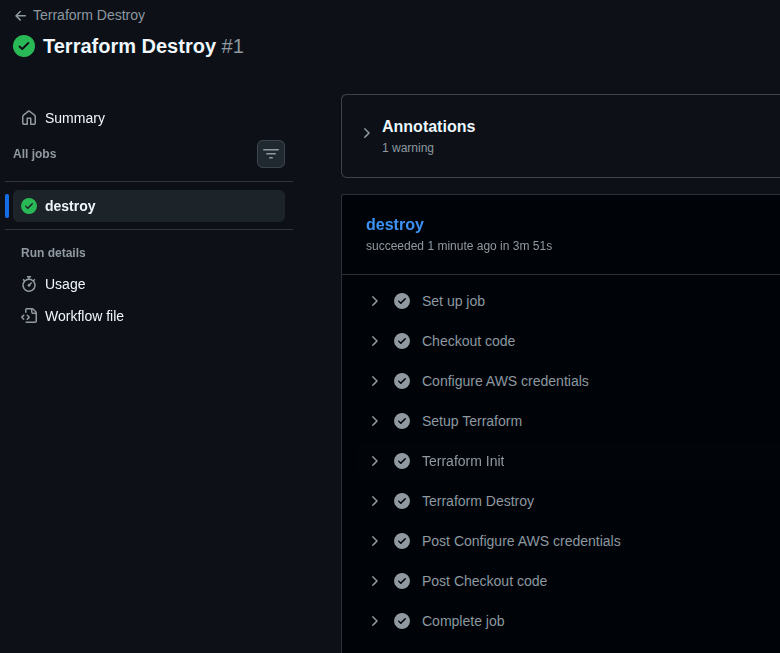

# headscale-ecs

A self-hosted Headscale (open-source Tailscale control plane) deployed on AWS ECS Fargate. Containerised via Docker and infrastructure managed with Terraform.

> New to Headscale? Read my blog post: [Understanding Headscale - The Self-Hosted Control Plane](https://ska-cloud.hashnode.dev/understanding-headscale-the-self-hosted-control-plane)

`headscale/` is a git submodule pointing to [juanfont/headscale](https://github.com/juanfont/headscale).

```bash
# Clone with submodule included: 
git clone --recurse-submodules https://github.com/ei-sei/headscale-aws.git
  
# Or if already cloned:   
git submodule update --init
```
## Repository structure

```
headscale-ecs/
├── headscale/
├── Dockerfile
├── config.production.yaml
├── terraform/
│   ├── main.tf
│   ├── variables.tf
│   ├── outputs.tf
│   └── modules/
│       ├── vpc/
│       ├── ecr/
│       ├── acm/
│       ├── nlb/
│       ├── ecs/
│       └── oidc/
├── .github/workflows/
│   ├── terraform.yml
│   ├── health-check.yml
│   └── deploy.yml
├── assets/
└── README.md
```

## Architecture


### Why NLB over ALB

I started with an NLB because I assumed WireGuard's UDP traffic needed to pass through the load balancer, and ALB doesn't support UDP at all. After digging into how Tailscale's protocol actually works, I learned WireGuard traffic is peer-to-peer between clients and never touches the Headscale server, so the NLB only needs to handle TCP/443 for the control plane.

At that point ALB would technically work too, since it's just HTTPS traffic. I kept NLB anyway: it's Layer 4 passthrough, so there's no TLS termination overhead at the load balancer and no extra HTTP routing layer to manage for a single backend service.

## Local setup

**Prerequisites:** Go [version: 1.26.3]

Start control server:
```
cd headscale
make dev-server
```

Verify it is working:

```bash
curl http://127.0.0.1:8080/health
```

## Docker

Copy the example config:
```bash
cp headscale/config-example.yaml config.yaml
```

Then update these two values in `config.yaml`:
```yaml
listen_addr: 0.0.0.0:8080
grpc_listen_addr: 0.0.0.0:50443
```

Build the image:
```bash
docker build -t headscale:latest .
```

Run the container:
```bash
docker run --rm -p 8080:8080 \
  -v $(pwd)/config.yaml:/etc/headscale/config.yaml \
  headscale:latest
```

Verify it is working:
```bash
curl http://127.0.0.1:8080/health
```

## Verifying the deployment

[terraform.yml](./.github/workflows/terraform.yml) (Terraform Check) - fmt, validate, and plan, run on every PR touching `terraform/**`:



[terraform-apply.yml](./.github/workflows/terraform-apply.yml) - applies infrastructure changes on push to `main`:



[deploy.yml](./.github/workflows/deploy.yml) (Deploy) - build, push to ECR, register a new task definition, deploy to ECS, post-deploy health check all passing:



ECS service running with the new task (1/1):



NLB target group reporting the task as healthy:



Health check against the live domain:


[terraform-destroy.yml](./.github/workflows/terraform-destroy.yml) - manual-trigger-only teardown of all infrastructure:



## Challenges I overcame

**Headscale crash-looping on ECS with no clear cause.** Locally, Headscale runs fine off a mounted `config.yaml`. On ECS there's no equivalent file mount, so the container kept exiting with config validation errors, one at a time: missing noise key path, invalid `server_url`, no DNS nameservers, no IP prefixes, no database type, no DERP map. I worked through each one using environment variables before realising a complete baked-in config file (matching what's already proven to work locally) was the simpler fix, rather than rediscovering every required field one failed deployment at a time.

**Cloudflare provider resolution in a child Terraform module.** Using a non-HashiCorp provider (Cloudflare) inside a module without declaring it in that module's own `required_providers` block causes Terraform to silently fall back to looking for `hashicorp/cloudflare`, which doesn't exist. The fix was simple once identified, but the error message gave no indication of the actual cause.

**Replacing long-lived AWS credentials with OIDC.** Initially used IAM access keys stored as GitHub secrets for the deploy pipeline. Migrated to GitHub's OIDC provider with a scoped IAM role trust policy, so the pipeline authenticates with short-lived, automatically-expiring credentials instead of static keys that never expire on their own.
