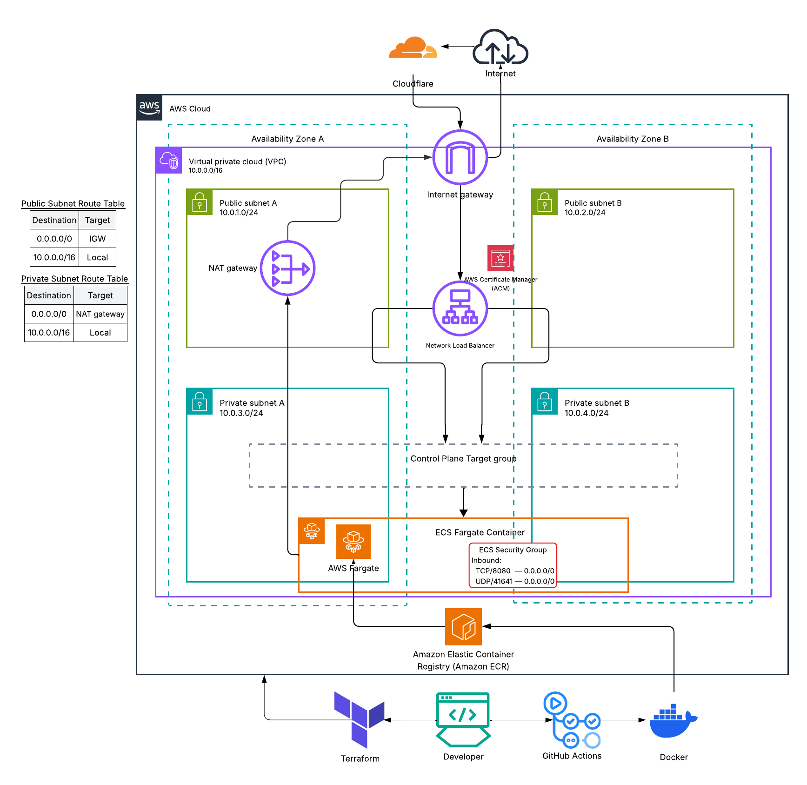
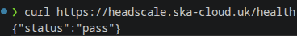

# headscale-ecs

A self-hosted Headscale (open-source Tailscale control plane) deployed on AWS ECS Fargate. Containerised via Docker and infrastructure managed with Terraform.

> New to Headscale? Read my blog post: [Understanding Headscale - The Self-Hosted Control Plane](https://ska-cloud.hashnode.dev/understanding-headscale-the-self-hosted-control-plane)

`headscale/` is a git submodule pointing to [juanfont/headscale](https://github.com/juanfont/headscale).


- Clone with submodule included: 
  ```git
  git clone --recurse-submodules https://github.com/ei-sei/headscale-aws.git
  ```

- Or if already cloned:   
  ```git
  git submodule update --init
  ```

## Repository structure

```
headscale-ecs/
├── headscale/
├── Dockerfile
├── config.production.yaml
├── terraform/
│   ├── main.tf
│   ├── variables.tf
│   ├── outputs.tf
│   └── modules/
│       ├── vpc/
│       ├── ecr/
│       ├── acm/
│       ├── nlb/
│       ├── ecs/
│       └── oidc/
├── .github/workflows/
│   ├── terraform.yml
│   ├── health-check.yml
│   └── deploy.yml
├── assets/
└── README.md
```

## Architecture



## Local setup

**Prerequisites:** Go [version: 1.26.3]

Start control server:
```
cd headscale
make dev-server
```

Verify it is working:

```bash
curl http://127.0.0.1:8080/health
```

## Docker

Copy the example config:
```bash
cp headscale/config-example.yaml config.yaml
```

Then update these two values in `config.yaml`:
```yaml
listen_addr: 0.0.0.0:8080
grpc_listen_addr: 0.0.0.0:50443
```

Build the image:
```bash
docker build -t headscale:latest .
```

Run the container:
```bash
docker run --rm -p 8080:8080 \
  -v $(pwd)/config.yaml:/etc/headscale/config.yaml \
  headscale:latest
```

Verify it is working:
```bash
curl http://127.0.0.1:8080/health
```

### Health check on applied infrastructure

